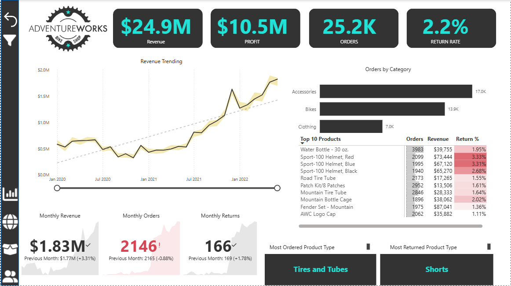
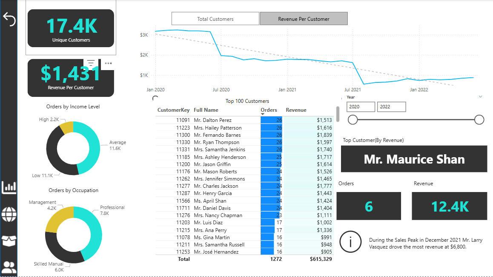
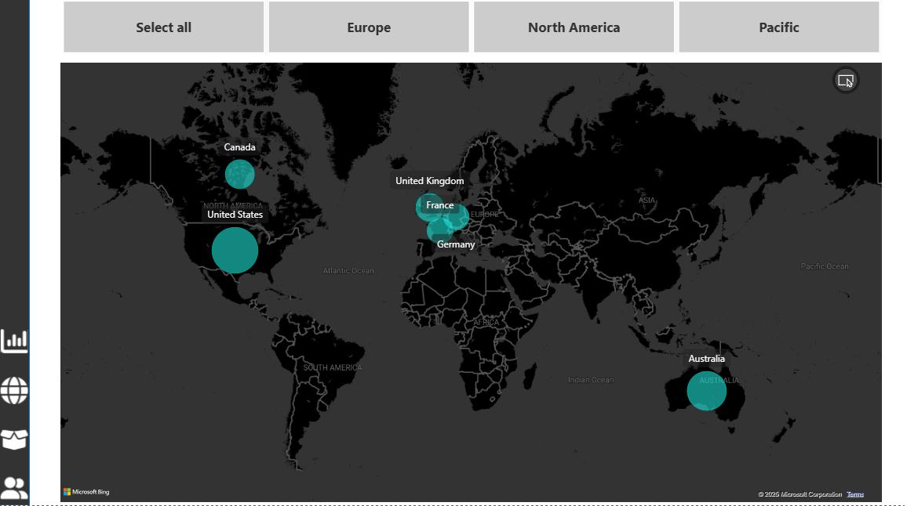

# 📊 Adventure Works Power BI Dashboard

Welcome to the **Adventure Works Report**, a professional and interactive Power BI dashboard project that simulates real-world business intelligence reporting for a fictional company.

## 🚀 Project Overview

This Power BI report provides actionable insights across key business areas including **Executive Metrics**, **Customer Profiles**, **Geographical Sales**, and **Product Performance**. It's designed to support decision-makers at every level of the organization.

✅ Built in Power BI Desktop  
✅ Dynamic visuals and cross-filtering  
✅ Clean, intuitive layout for executives and analysts alike

## 🧠 Key Features

- 💼 **Executive Dashboard** – At-a-glance KPIs for revenue, profit, and performance by category.
- 👤 **Customer Detail** – Dive into customer demographics, buying behavior, and segmentation.
- 🗺️ **Geographical Map View** – Visualize sales trends by region with an interactive heatmap.
- 📦 **Product Detail** – Analyze top-selling items, inventory status, and profitability metrics.

## 🖼️ Dashboard Snapshots

### 💼 Executive Dashboard

### 👤 Customer Detail View

### 🗺️ Regional Map Analysis

### 📦 Product Performance Detail

## 🛠️ Tools Used

- Microsoft Power BI Desktop  
- Power Query & DAX  
- Custom visuals, slicers, drill-throughs, and bookmarks  
- Data storytelling through layout, color, and interactivity  

## 📁 Files Included

- `Adventure Works Report.pbix` – Full Power BI report file  

## 🔎 What You’ll Learn

This project demonstrates my ability to:

- Model complex datasets into a clean semantic layer  
- Build intuitive and visually engaging reports  
- Translate data into actionable business insights  

---

🎯 *Explore this project to see how I leverage data visualization to empower better decision-making.*  
📬 Questions or feedback? Feel free to reach out!

